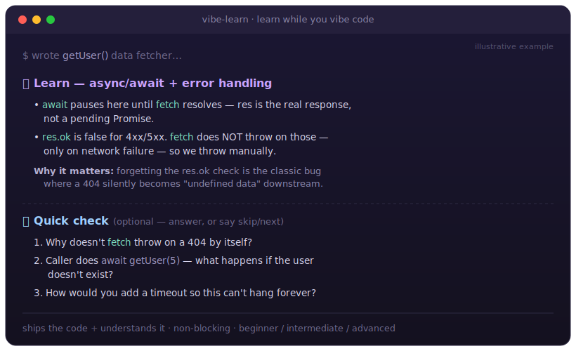

<div align="center">

# 🎓 vibe-learn

**Learn while you vibe code.**

A [Claude Code](https://claude.com/claude-code) skill that turns "the AI wrote it, I don't know how" into "I shipped it *and* I understand it." After writing meaningful code, Claude surfaces the **major concepts** in it (jargon explained from scratch) and **quizzes you** so the knowledge actually sticks — without ever slowing down your build.

[](https://code.claude.com/docs/en/skills)
[](./LICENSE)
[](./CHANGELOG.md)

<br/>



</div>

---

## The problem

Vibe coding is fast, but it has a cost: you end up with a working app you can't explain. The code becomes a black box, and you don't grow as a developer. The usual fixes are all-or-nothing — either you stop and read docs (kills the flow), or you ship blind (kills the learning).

**vibe-learn** sits in the middle. It rides *alongside* the build:

- After a **meaningful** change (a new function, hook, tricky bit of logic), it adds a short **🎓 Learn** block — 2–4 key takeaways, with any jargon explained in plain words.
- At natural checkpoints it asks a **📝 Quick check** — 2–3 questions mixing recall, application, and debugging-traps.
- Quizzes are **non-blocking**: answer them, or type `skip`/`next` and keep shipping. It never stalls your work or nags.

It changes *nothing* about how the code itself gets written — same quality, same scope. It only adds teaching around it.

---

## Demo

You ask Claude to write a data fetcher. Alongside the code, you get:

> 🎓 **Learn — async/await + error handling**
> • `await` pauses inside this function until `fetch` resolves, so `res` is the real response, not a pending Promise.
> • `res.ok` is `false` for 4xx/5xx. `fetch` does **not** throw on those — only on network failure — so we throw manually to catch bad statuses.
> **Why it matters:** forgetting the `res.ok` check is the classic bug where a 404 silently becomes "undefined data" downstream.
>
> 📝 **Quick check** (optional — answer, or say skip/next)
> 1. Why doesn't `fetch` throw on a 404 by itself?
> 2. The caller does `const u = await getUser(5)` — what happens to them if the user doesn't exist?
> 3. How would you add a timeout so this can't hang forever?

Answer in your own words, and Claude gives instant, kind feedback. That's it.

---

## Install

> Requires Claude Code. New to skills? See the [official skills docs](https://code.claude.com/docs/en/skills).

### Option A — Copy install (recommended, gives a clean `/vibe-learn` command)

```bash
git clone https://github.com/rudrasatani13/vibe-learn.git
cp -r vibe-learn/plugins/vibe-learn/skills/vibe-learn ~/.claude/skills/
```

That's it — open Claude Code and type `/vibe-learn`. (Personal skills live in `~/.claude/skills/` and work across all your projects. For a single project only, copy into that project's `.claude/skills/` instead.)

One-liner (no manual clone):

```bash
git clone --depth 1 https://github.com/rudrasatani13/vibe-learn.git /tmp/vibe-learn && \
  cp -r /tmp/vibe-learn/plugins/vibe-learn/skills/vibe-learn ~/.claude/skills/ && \
  rm -rf /tmp/vibe-learn && echo "✅ vibe-learn installed — type /vibe-learn in Claude Code"
```

### Option B — Plugin marketplace (managed install + auto-updates)

```text
/plugin marketplace add rudrasatani13/vibe-learn
/plugin install vibe-learn@vibe-learn
```

The command is namespaced as `/vibe-learn:vibe-learn` with this method. Update later with `/plugin marketplace update vibe-learn`.

---

## Usage

Turn it on once per session; it stays active until you turn it off.

| Command | What it does |
| :--- | :--- |
| `/vibe-learn` | Learn mode **ON** at the default **intermediate** level |
| `/vibe-learn beginner` | ON — every term explained from zero, gentle questions |
| `/vibe-learn advanced` | ON — only deep / non-obvious ideas, tougher questions |
| `/vibe-learn off` | Turn it off, back to normal building |

You can also just say it in plain language — *"teach me as you build"*, *"learn mode on"*, *"I want to actually understand this"* — and Claude will activate it.

### Levels

| Level | Takeaways focus | Quiz difficulty |
| :--- | :--- | :--- |
| `beginner` | Every term from zero, simplest words | Recall-heavy, gentle |
| `intermediate` *(default)* | Patterns, trade-offs, the "why" | Mix of recall + application |
| `advanced` | Only non-obvious / easy-to-get-wrong things | Application + debugging-traps |

It also **matches your language** — write in Hinglish and the lessons come back in Hinglish.

---

## Always-teach mode (optional, deterministic)

The `/vibe-learn` skill is *soft* — Claude decides when a change is worth teaching. If you'd rather **guarantee** a 🎓 Learn reminder after every source-code edit, add the bundled hook. It's a `PostToolUse` hook that fires on `Write`/`Edit`, skips non-code files (docs, config, data), and injects a factual reminder so Claude reliably teaches. Pair it with the skill for the full style.

**Setup** (requires [`jq`](https://jqlang.github.io/jq/)):

```bash
# 1. Copy the hook somewhere stable and make it executable
mkdir -p ~/.claude/hooks
cp vibe-learn/plugins/vibe-learn/hooks/always-teach.sh ~/.claude/hooks/vibe-learn-always-teach.sh
chmod +x ~/.claude/hooks/vibe-learn-always-teach.sh
```

```jsonc
// 2. Add to ~/.claude/settings.json  (merge into any existing "hooks")
{
  "hooks": {
    "PostToolUse": [
      {
        "matcher": "Write|Edit",
        "hooks": [
          {
            "type": "command",
            "command": "$HOME/.claude/hooks/vibe-learn-always-teach.sh",
            "timeout": 15
          }
        ]
      }
    ]
  }
}
```

To turn it off, remove that block from `settings.json`. It's intentionally **not** auto-enabled, so the default experience stays non-blocking.

---

## How it works

vibe-learn is a standard [Agent Skill](https://agentskills.io). When invoked, its instructions stay in context for the session and act as standing guidance: after each *major* change Claude adds a Learn block; after trivial edits (typos, renames, formatting) it stays silent. The teaching method is **ground-up** — no jargon is ever left undefined — and questions are designed to prove understanding, not test syntax trivia.

```
vibe-learn/
├── .claude-plugin/
│   └── marketplace.json           # marketplace manifest (Option B install)
├── plugins/
│   └── vibe-learn/
│       ├── .claude-plugin/
│       │   └── plugin.json         # plugin manifest
│       ├── hooks/
│       │   └── always-teach.sh     # optional deterministic "always-teach" hook
│       └── skills/
│           └── vibe-learn/
│               ├── SKILL.md        # the skill: behaviour, triggers, quiz logic
│               └── reference.md    # teaching methodology, question patterns, examples
├── assets/
│   └── example.svg                 # illustrative example shown above
├── README.md
├── LICENSE
└── CHANGELOG.md
```

---

## Roadmap

- [x] Optional `PostToolUse` hook for guaranteed teaching after *every* edit — see [Always-teach mode](#always-teach-mode-optional-deterministic). *(added in v1.1.0)*
- [ ] A lightweight per-session "what you learned" recap.
- [ ] More worked examples across languages/stacks in `reference.md`.

Ideas and PRs welcome.

---

## Contributing

This is a single-file-ish skill — contributions are easy. Open an issue or PR. If you change behaviour, please update both `SKILL.md` and the matching section in `README.md`. To test locally, copy the skill into `~/.claude/skills/` (see Option A) and try it in a real session.

## License

[MIT](./LICENSE) © 2026 Rudra Satani

<div align="center">
<sub>Built with Claude Code. If vibe-learn taught you something, a ⭐ helps others find it.</sub>
</div>
